````markdown
# 🤖 Mr. Robot CTF Write-up

> **Platform:** TryHackMe  
> **Difficulty:** Easy  
> **Operating System:** Linux  
> **Status:** ✅ Rooted  
> **Date Completed:** 28/06/2026


---

## 📖 Overview

This room introduced me to several fundamental penetration testing concepts, including enumeration, WordPress exploitation, reverse shells, password cracking, and Linux privilege escalation. This write-up documents the methodology I followed to obtain all three flags.

---

## 🛠️ Tools Used

- Nmap
- Gobuster
- WPScan
- Netcat
- John the Ripper
- Hash Identifier
- CrackStation
- Python
- Linux commands

---

## 🔍 Enumeration

The first step was performing an Nmap scan against the target.

```bash
nmap -A <target-ip>
````

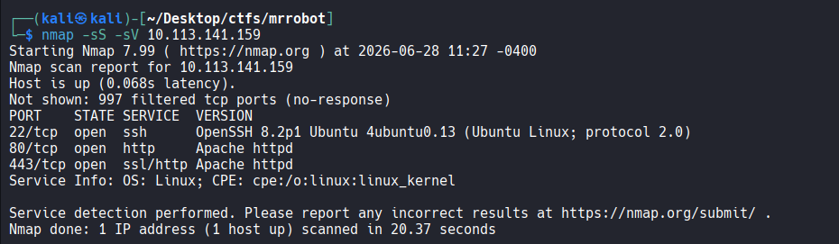

The scan revealed an HTTP service running on port 80.

After opening the website, the first file I checked was `robots.txt`.

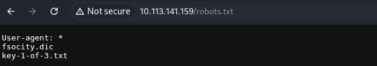

Inside `robots.txt` I discovered the first flag together with the `fsocity.dic` wordlist.

While manually exploring the website, I also launched Gobuster to enumerate hidden directories.

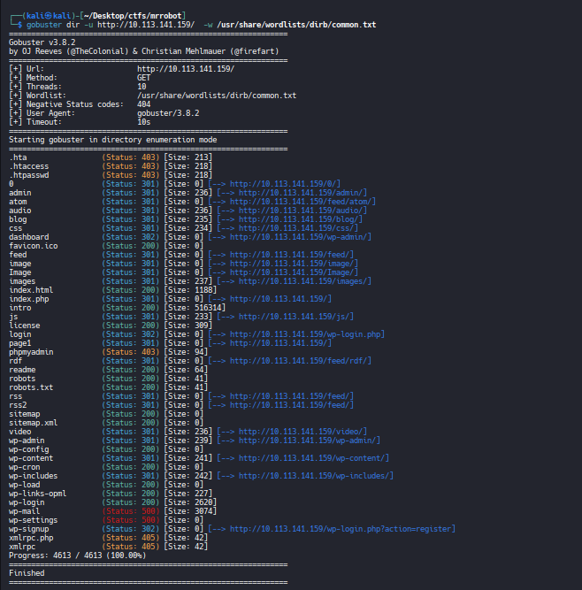

Gobuster revealed that the application was running on WordPress, which I had also confirmed by inspecting the page source.

---

# 🌐 WordPress Enumeration

I started WPScan looking for vulnerable plugins and themes.

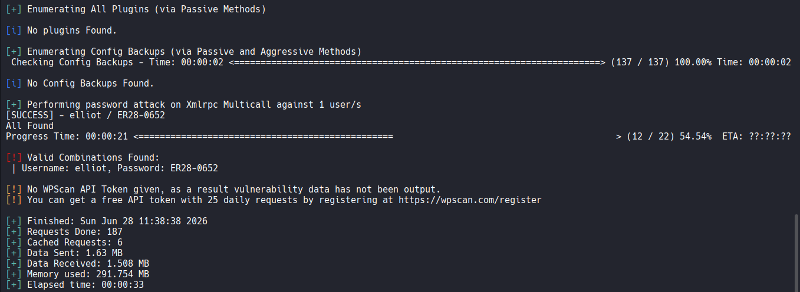

Initially nothing useful appeared, so I went back to `robots.txt` and noticed the `fsocity.dic` wordlist. I then used WPScan to perform a password attack against the WordPress login through XML-RPC.

After some time I successfully recovered valid administrator credentials and logged into the WordPress dashboard.

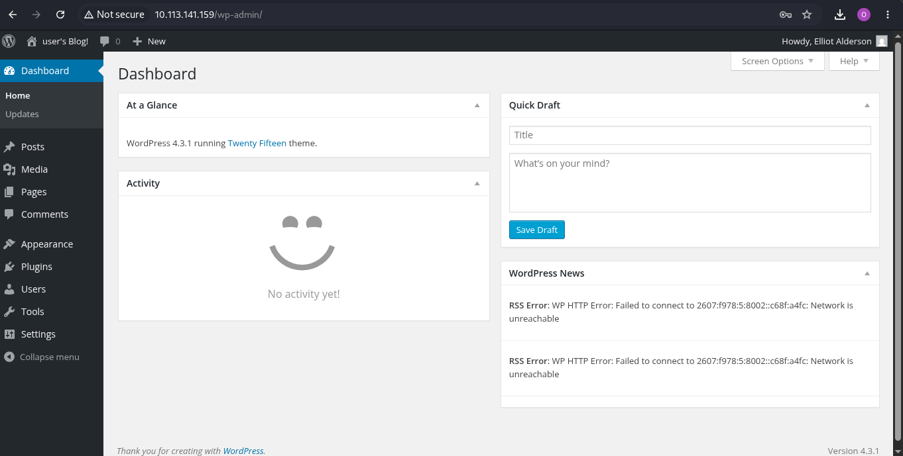

---

# 💻 Initial Foothold

My first idea was uploading a malicious plugin, but plugin uploads were disabled.

Instead, I opened the Theme Editor and modified `archive.php`, replacing its contents with a PHP reverse shell.

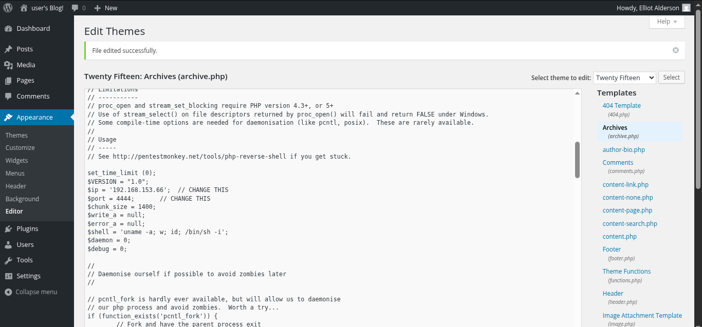

On my Kali machine I started a Netcat listener.

```bash
nc -lvnp 4444
```

After opening the edited archive page, the reverse shell connected back to my machine.

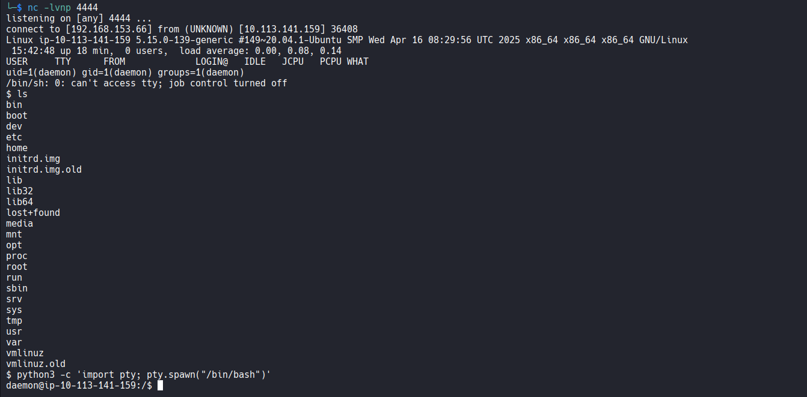

---

# 🚀 Privilege Escalation

Inside the compromised machine I found two interesting files in the robot user's home directory. One contained the second flag, while the other stored an MD5 password hash.

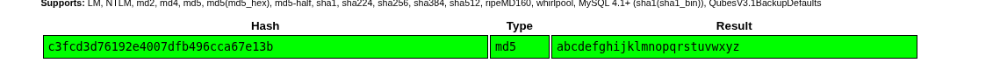

The hash was:

```text
robot:c3fcd3d76192e4007dfb496cca67e13b
```

I identified it as MD5. I first attempted to crack it locally with John the Ripper and the supplied wordlist. Since the password was not recovered in my environment, I verified the hash using CrackStation and recovered the plaintext password.

I then switched to the robot account.

```bash
su robot
```

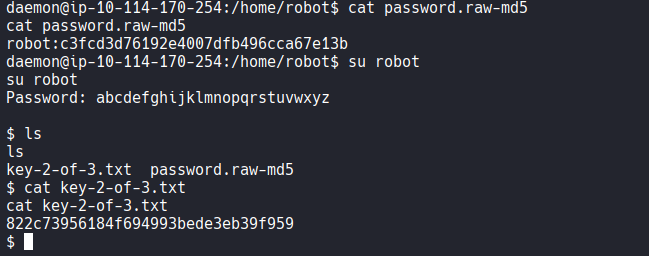

After gaining access to the robot account, I searched the system for SUID binaries.

```bash
find / -perm -4000 -type f 2>/dev/null
```

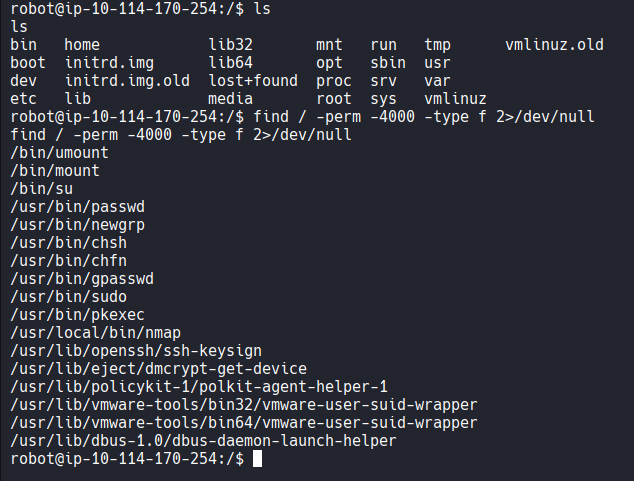

Among the results, `/usr/local/bin/nmap` immediately caught my attention. It was an old version of Nmap with the SUID bit enabled.

Older versions include interactive mode, allowing command execution.

```bash
/usr/local/bin/nmap --interactive
```

Inside interactive mode I executed:

```bash
!sh
```

A root shell was spawned successfully.

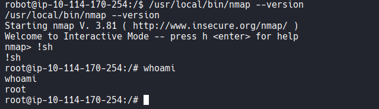

I verified my privileges:

```bash
whoami
```

Output:

```text
root
```

Finally, I navigated to the root directory and obtained the last flag.

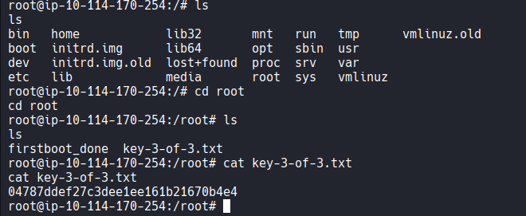

---

# ✅ Room Completed

After submitting the final flag, the room was successfully completed.


---

# 🎯 Lessons Learned

This room reinforced one of the most important lessons in penetration testing: **enumeration is everything**.

A single overlooked file (`robots.txt`) completely changed the attack path. Throughout this challenge I practiced:

* Enumeration with Nmap and Gobuster
* WordPress reconnaissance
* Password attacks with WPScan
* Reverse shell techniques
* Hash identification and password recovery
* Linux privilege escalation through SUID binaries

Overall, this room was an excellent introduction to web exploitation and privilege escalation. It was both enjoyable and educational, and I highly recommend it to beginners who want to strengthen their penetration testing fundamentals.

```
```
